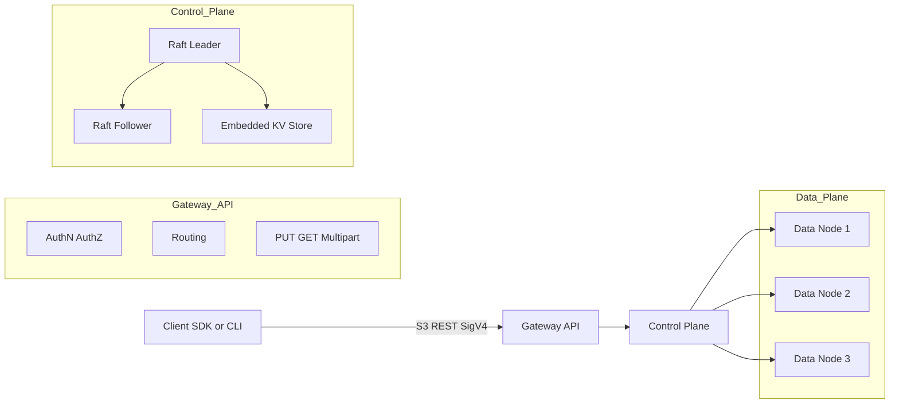
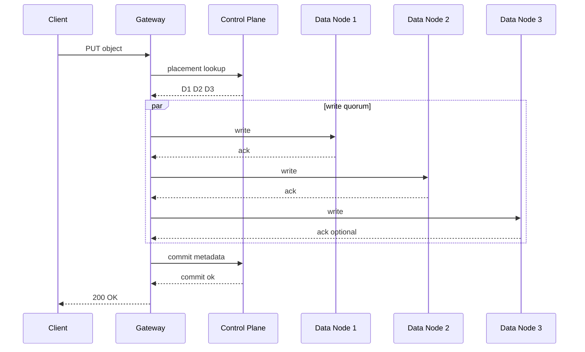
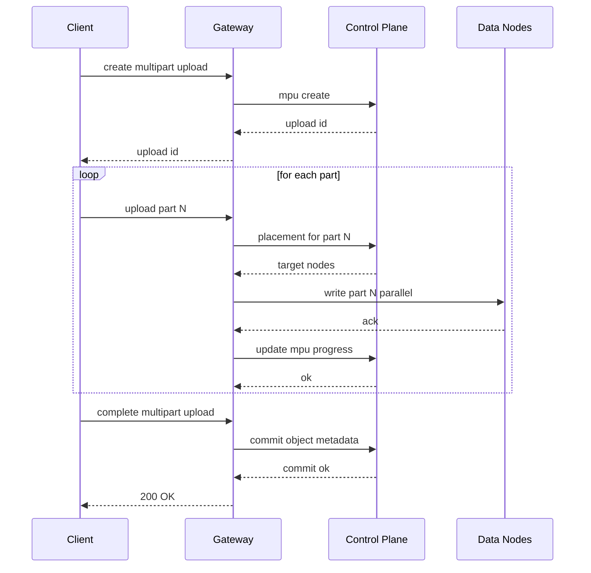
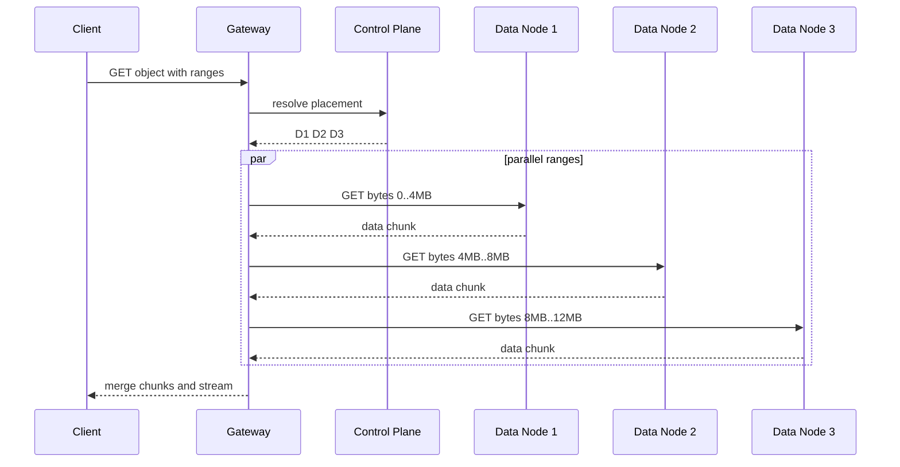
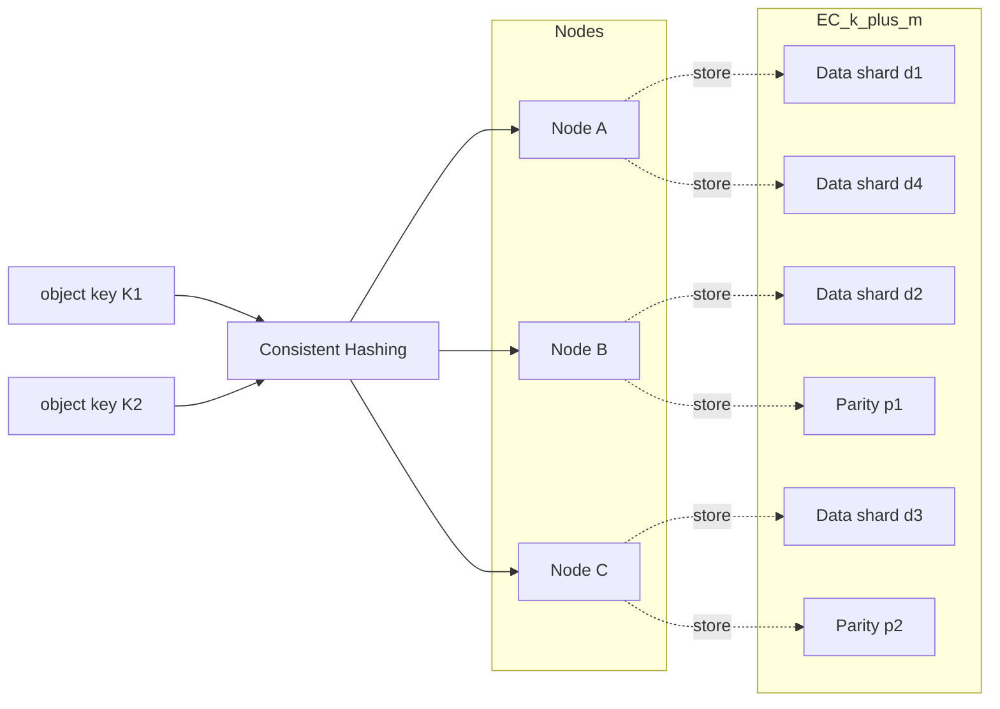
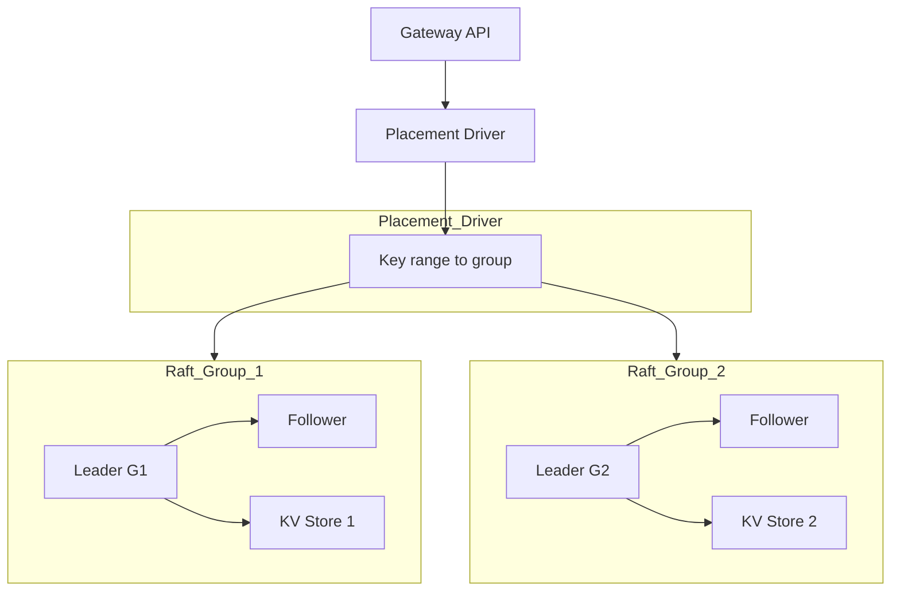
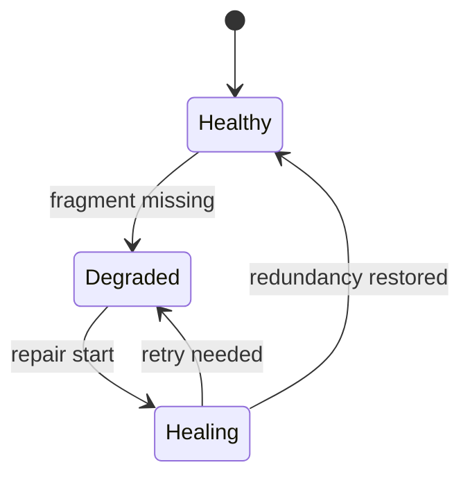

# オブジェクトストレージ自作設計メモ（Go + Raft）

## 全体構成
- **Control plane（メタデータ層）**  
  Bucket/オブジェクト名 → 場所、バージョン、パーツ、ポリシー等の**唯一の真実**。  
  Raftリーダが書き込みを直列化。

- **Data plane（データ層）**  
  実体（オブジェクト/パーツ）を複数ノードに**レプリカ**または**イレージャーコーディング(EC)**で配置。  
  HTTP Range GETや並列PUTを高速化。

- **Gateway/API 層**  
  S3互換REST (SigV4)、認証・認可、マルチパート、一覧、ポリシーなど。

---

## MVP

### 1) メタデータと合意（Raft）
- **ライブラリ**：`etcd/raft`（低レベルで柔軟）または `hashicorp/raft`（実装しやすい）
- **K/Vスキーマ例**
  - `bucket/<name>`：バケット属性
  - `obj/<bucket>/<key>`：ヘッダ（サイズ、ETag、バージョン、パーツ一覧、placement）
  - `mpu/<bucket>/<uploadId>`：マルチパート進行中
- **永続化**：Raftログ + スナップショット（Badger/Pebble/Boltなどの埋め込みKV）  
  → 起動高速化とログ肥大防止のスナップショット/ログ圧縮は必須

### 2) データ保存（Data node）
- **レイアウト**：`/data/<volume>/<shard>/<objectID>/<partN>` の **append-only**（追記）+ **tombstone**  
  → クラッシュ後のリプレイが楽。断片化は後述GCで回収
- **配置**：コンシステントハッシュ（仮想ノード）でN台選出（MVPはN=3レプリカ）
- **整合性**：  
  PUTはデータノードN台へ書き込み → **クォーラムACK**（例：2/3） → 最後にメタデータをRaftでコミット  
  途中失敗分は**オーファンGC**で後始末

### 3) S3 API最小セット
- **Bucket**：Create / Delete / List
- **Object**：PUT / GET / HEAD / DELETE、Range GET、ETag(MD5またはcontent-hash)
- **Multipart Upload**：Initiate / UploadPart / Complete / Abort（並列化の要）
- **Auth**：AWS SigV4（HMAC）
- **一覧 (LIST)**：プレフィックス+マーカー（v2のContinuationTokenでもOK）

### 4) 基本の可用性・監視
- **機能**：ヘルスチェック、リバランス（ノード増減時に再配置）、修復 (healing)（欠損レプリカの自動再生成）
- **メトリクス**：Prometheus（レイテンシ、失敗率、Raftラグ、ディスク使用）+ OpenTelemetry Traces
- **TLS**：最初はサーバTLS、後でmTLSも

---

## 本番向けに足すべき要素（ロードマップ）

### A) スケールするメタデータ
- 単一Raftグループの限界：QPS/レイテンシの頭打ち
- 水平分割：メタデータシャーディング（複数Raftグループ）＋ Placement Driver（TiKV風）  
  → バケットやキー範囲でシャード分け、ホットシャードのスプリット/マージ
- ストア：Pebble or Badger（LSM）+ Bloom FilterでLIST/HEAD高速化

### B) データ耐久性と効率
- **イレージャーコーディング**：`k+m`（例：4+2や8+3）。Goなら `klauspost/reedsolomon` が実績大
  - 耐久性：m台まで喪失OK
  - Writeパス：パリティ生成 → m+1以上のACKで可（可用性/耐久性のトレードオフ）
- **障害ドメイン**：ラック/AZアフィニティで配置（同一筐体偏りを回避）
- **リペア (healing)**：バックグラウンドで不足フラグメントを再生成

### C) 一貫性モデル
- **読み取り整合性**
  - 同一キーのRead-after-Write強整合（メタデータをリーダ経由/lease-read）
  - Listは最初はEventually、要件次第で整合List（高コスト：インデックスやVersion Mapが必要）
- **バージョニング**：`obj`に`versionId`付与、DeleteMarker対応、オブジェクトロック/WORM（準拠要件向け）

##  MVP用語解説

- **Raft**  
  - 分散合意アルゴリズム。クラスタ内で「リーダー」を選出し、すべての書き込みをリーダー経由で順序付ける。  
  - これにより、複数ノードに同じ状態（メタデータ）を複製できる。  
  - Paxosより実装しやすく、Go言語では `etcd/raft` や `hashicorp/raft` が広く使われている。  

- **Control plane（メタデータ層）**  
  - オブジェクトストレージの「唯一の真実（Single Source of Truth）」を保持する層。  
  - バケットやオブジェクトの場所、サイズ、バージョン、パーツ情報、ポリシーを管理。  
  - LISTやHEADリクエストの処理もこの層を参照して行う。  

- **Data plane（データ層）**  
  - 実際のオブジェクトデータを保持する領域。  
  - ファイルシステム上では `/data/<volume>/<shard>/<objectID>/<partN>` の形で保存。  
  - append-only（追記型）設計により、クラッシュ後も簡単にリプレイできる。削除は tombstone マーカーで扱い、後でGCが掃除。  

- **コンシステントハッシュ**  
  - オブジェクトを格納するノードを決めるアルゴリズム。  
  - ノードを「リング」に配置し、オブジェクトキーのハッシュ値で担当ノードを選出。  
  - ノード追加・削除時も一部データの移動だけで済むため、スケーラブル。  

- **クォーラムACK**  
  - 例えば3台にレプリカを配置する場合、2台からACKが返れば書き込み成功とみなす方式。  
  - 可用性と一貫性のバランスを取る。N台中の過半数以上の応答が条件。  

- **オーファンGC (Garbage Collection)**  
  - PUT中に失敗してメタデータに登録されなかったデータ片（孤児データ）をクリーンアップする仕組み。  
  - 定期的に走るバックグラウンドプロセスとして実装するのが一般的。  

- **Raftログ + スナップショット**  
  - Raftは全ての操作をログに記録するが、ログが肥大化すると起動が遅くなる。  
  - スナップショットで現在の状態を保存し、古いログを圧縮（削除）して高速化する。  
  - etcdやTiKVでも同様の仕組みを採用。  

- **Badger / Pebble / Bolt**  
  - Goで利用できる埋め込み型のKey-Valueストア。  
  - Raftの状態永続化やメタデータ管理に利用。  
  - Badger：RocksDB風のLSMツリー実装  
  - Pebble：CockroachDB開発チーム製  
  - Bolt：シンプルなB+木ベース  

- **S3互換REST (SigV4)**  
  - AWS S3と同じAPI仕様を持つことで既存のクライアントやSDKを利用可能にする。  
  - SigV4はHMAC署名方式の認証・認可スキームで、時間制限付きの認可を実現できる。  

- **マルチパートアップロード**  
  - 大容量オブジェクトを複数のパーツに分割して並列アップロード。  
  - 中断・再開が可能で、アップロード効率も改善される。  
  - 完了時にパーツを結合して最終オブジェクトを生成。  

---

##  本番向け用語解説

- **Placement Driver (TiKV風)**  
  - 単一のRaftグループではQPS（処理数）やレイテンシに限界があるため、メタデータをシャーディングする。  
  - 複数のRaftグループを束ね、どのキーがどのグループに属するかを管理する役割を持つ。  
  - バケット単位やキー範囲で分割し、ホットスポットは自動でスプリット/マージ可能にする。  

- **Bloom Filter**  
  - 高速に「存在する可能性がある / ない」を判定できる確率的データ構造。  
  - メタデータ層でLISTやHEAD処理を高速化し、無駄なディスクアクセスを削減できる。  

- **イレージャーコーディング (EC)**  
  - データを k 個のデータ片と m 個のパリティ片に分割し、最大 m 個までのノード障害に耐えられる。  
  - 例：4+2構成なら6分割し、2つまで失っても復元可能。  
  - RAIDの冗長化より効率的にストレージを利用できる。  

- **Reed-Solomon (klauspost/reedsolomon)**  
  - Goで広く使われるイレージャーコーディングライブラリ。  
  - 高速かつ安定しており、分散ストレージ（MinIOなど）でも採用実績がある。  

- **障害ドメイン (Failure Domain)**  
  - ノード配置をラックやアベイラビリティゾーンごとに分散させ、単一筐体障害で複数コピーを失わないようにする設計。  
  - 大規模システムでは必須の考え方。  

- **Healing（修復）**  
  - レプリカやECフラグメントが欠損した場合に、自動で再生成して冗長性を回復するプロセス。  
  - バックグラウンドで動作し、ユーザーには透過的に修復が行われる。  

- **Read-after-Write強整合**  
  - 書き込み直後に必ず最新データを読み取れる保証。  
  - メタデータをRaftリーダー経由で処理することで実現。  

- **Eventually Consistent（結果整合性）**  
  - List操作やオブジェクトの更新タイミングでは、古い状態が見えることもあるが、最終的には全ノードで整合する。  
  - 可用性を優先するために採用される。  

- **Delete Marker**  
  - S3バージョニングでの「論理削除」を表す仕組み。  
  - オブジェクト自体は残したまま「削除マーカー」を追加することで、過去バージョンにロールバック可能。  
  - WORM（Write Once Read Many）やコンプライアンス要件にも対応できる。  

## 全体アーキテクチャ

## PUTのライフサイクル

## マルチパートアップロード

## GETとRange GET

##  データ配置とEC

## メタデータとスケールアウト

## Healingの状態推移

